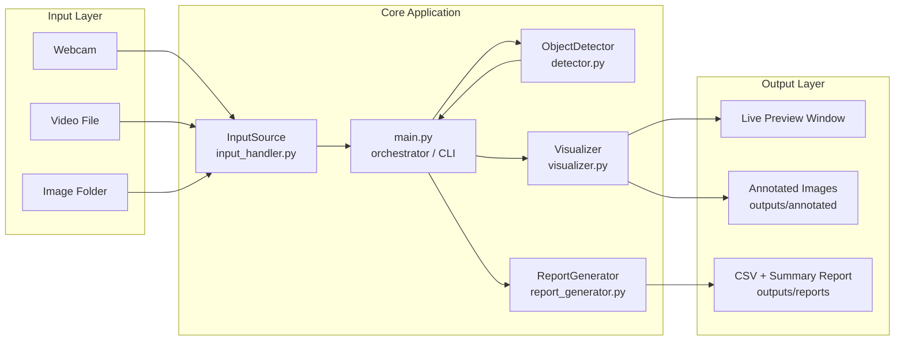
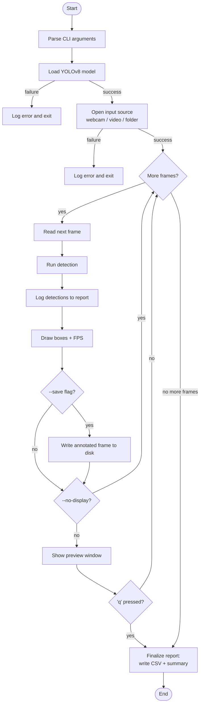
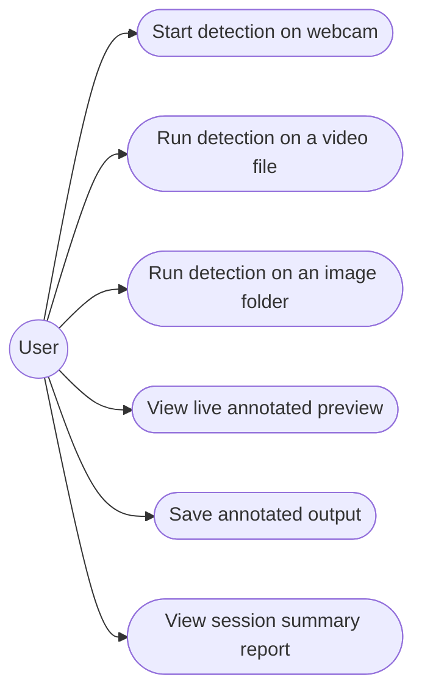
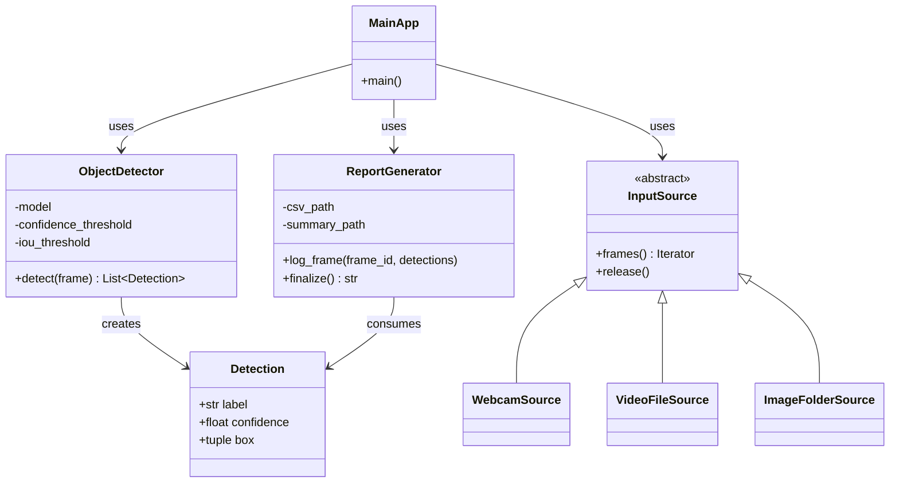
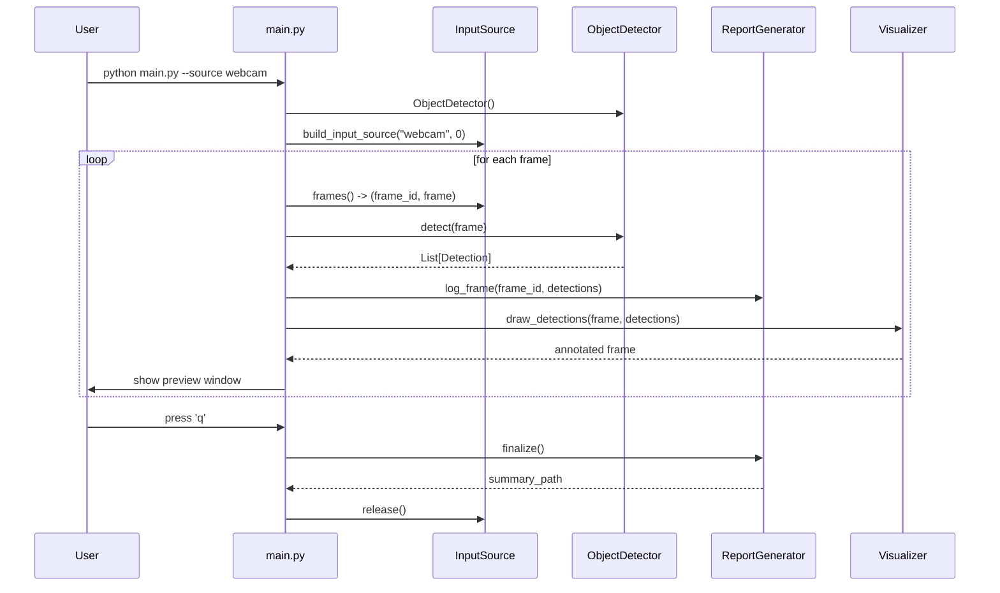

# Design & Documentation

This file contains the required design artefacts for the project:
Problem Statement / Objectives (see `statement.md`), Functional &
Non-Functional Requirements, System Architecture, Workflow, and UML
diagrams. Diagrams are written in Mermaid syntax — they render
automatically on GitHub and in most Markdown viewers (VS Code, Obsidian,
etc.).

## Objectives
- Detect common real-world objects accurately enough for everyday use
  (person, vehicle, animal, everyday items) using a pretrained model.
- Support three input modes (webcam / video file / image folder)
  through one consistent interface.
- Produce an auditable record (CSV + summary) of what was detected in
  a session, not just a live preview.
- Keep the codebase modular enough that the detection model, the input
  source, or the reporting format can each be swapped independently.

## Functional Requirements
| # | Requirement |
|---|-------------|
| FR1 | The system shall detect and classify objects in a frame using a pretrained deep-learning model, returning label, confidence, and bounding box for each detection. |
| FR2 | The system shall accept input from a webcam, a video file, or a folder of images through a single unified interface. |
| FR3 | The system shall log every detection (frame id, label, confidence, box coordinates) to a CSV file and produce a human-readable summary at the end of a run. |
| FR4 | The system shall render bounding boxes, class labels, confidence scores and a live FPS counter on the output frame. |
| FR5 | The system shall allow the user to save annotated frames/images to disk via a command-line flag. |

## Non-Functional Requirements
| # | Category | Requirement |
|---|----------|-------------|
| NFR1 | **Performance** | The system should sustain real-time-comparable throughput on CPU (nano model, frame resizing) and reports FPS live so the user can judge performance on their machine. |
| NFR2 | **Reliability** | Camera/video/model failures raise clear, caught exceptions (`DetectorError`, `InputSourceError`) instead of crashing with a raw traceback; a single bad frame is skipped, not fatal. |
| NFR3 | **Security** | All file-based inputs are validated against an extension allow-list and existence check before being opened (`_validate_path`), preventing accidental processing of arbitrary/unsafe files. |
| NFR4 | **Usability** | A single CLI (`main.py`) with sensible defaults and `--help` covers all three input modes; live preview window shows FPS and labels directly. |
| NFR5 | **Maintainability** | Each concern (detection, input handling, drawing, reporting, logging, configuration) lives in its own module with a single responsibility. |
| NFR6 | **Logging/Monitoring** | A shared logger (`logger_setup.py`) writes timestamped, leveled logs to both console and `logs/app.log` for every module. |
| NFR7 | **Scalability** | New input types (e.g. an RTSP network stream) or a different model (e.g. a larger YOLO variant) can be added by extending `InputSource` or swapping `MODEL_NAME`, without touching other modules. |
| NFR8 | **Resource efficiency** | Frame size is capped (`FRAME_WIDTH`/`FRAME_HEIGHT`), a nano model is used by default, and a `PROCESS_EVERY_N_FRAMES` config option allows frame-skipping on slower hardware. |

## System Architecture Diagram

## Process Flow / Workflow Diagram

## Use Case Diagram

## Class Diagram

## Sequence Diagram (one frame, webcam mode)

## Note on Database/Storage Design
This project does not use a database. Persistent output is file-based
(CSV detection logs and text summaries under `outputs/reports/`), which
is sufficient for the project's scope. If a future enhancement added
multi-session history/search, an ER diagram and schema would be added
here at that point (see `Future Enhancements` in the report).
